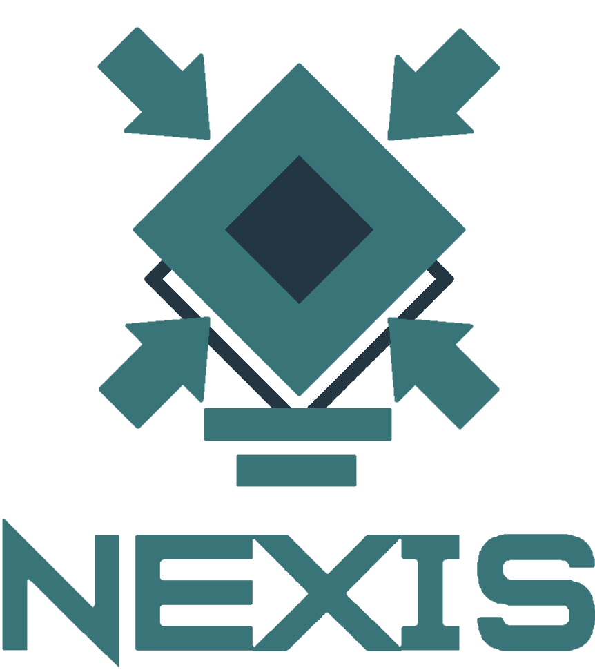

<div align='center'>
    
</div>

#
Nexis is a fully self-hosted mall management platform currently in development, created for a fictional mall of the same name. It streamlines the shopping experience for users and delivers insightful analytics for store owners. The platform features four unique stores:

* Readon: A library offering a variety of books, pens, notebooks, and other stationery items.
* Vesti: A clothing store which caters to all your clothing needs, from shoes to shirts.
* Cyberion: A tech store featuring a wide selection of phones, computers, and various gadgets.
* Savoro: A food store, your go-to place for all things foody.

Nexis allows customers to effortlessly browse and buy products, while owners can track and assess their store’s performance with detailed, real-time insights.

## Table of Contents

* [Features](#features)
* [Technologies used](#technologies-used)
* [Architecture](#architecture)
* [Installation](#installation)
* [Developers](#developers)
* [License](#license)

## Features

### For Clients

* Unified Shopping Experience: Browse and purchase products from multiple stores within a single app.
* User-Friendly Interface: Intuitive design with a responsive and engaging UI.
* Secure Authentication: Login and registration with email verification.
* Real-Time Updates: Instant updates on product availability and order status.

### For Store Owners and Employees

* Comprehensive Analytics: View detailed statistics and insights for your store, including sales and customer behavior.
* Inventory Management: Efficiently manage products and track sales.
* Employee Operations: Employees can perform in-store charging operations for physical purchases, ensuring smooth transactions.
* Customer Insights: Access data to improve product offerings and customer experience.

## Technologies Used

* Frontend: SvelteKit, Tailwind CSS, Bootstrap
* Backend: Rust (Actix-web), Python (Flask)
* Databases: PostgreSQL, MongoDB

## Architecture

Nexis follows a modular architecture, separating concerns between the frontend and backend to ensure scalability and maintainability.

* Frontend: Handles user interactions, routing, and rendering of the user interface.
* Backend: Manages business logic, handles API requests, and interacts with the PostgreSQL and MongoDB databases.
* Databases:
  * MongoDB: Serves as the primary database for daily interactions, storing data that employees and users frequently access.
  * PostgreSQL: Acts as a data warehouse for storing comprehensive statistics and analytics.

## Setup
### Prerequisites
* Node
* Rust toolchain
* PostgreSQL
* Redis
* Mkcert (only if **developing**)
* Nginx (only if **deploying**)

### Setup for development
#### Rust backend
1. Set the `APP_ENVIRONMENT` environment variable to "development".
2. `cd` into the rust backend directory.
3. Set the settings .yaml files.
4. Create the CA certificate:
```
    mkdir cert
    cd cert
    mkcert -cert-file cert.pem -key-file key.pem localhost
```
5. Ensure you are in the rust backend directory and run `cargo run`.
5. Type `https://localhost/health-check` in a browser to verify connectivity.

#### Frontend
1. `cd` into the frontend directory root.
2. Run `npm install`.
3. Create the CA certificate:
```
    mkdir cert
    cd cert
    mkcert -cert-file cert.pem -key-file key.pem localhost
```
4. Create a ".env" file in the frontend directory root, and set `VITE_API_URI_DEV` inside of it. If following this setup guide, it should be `https://localhost:443`.
5. Set the `NODE_EXTRA_CA_CERTS` environment variable to the root CA .pem file path. If generating the certs with mkcert on Windows, set it to `C:\Users\YOUR_USER\AppData\Local\mkcert\rootCA.pem`.
6. Ensure you are in the frontend directory root and run `npm run dev`.

### Setup for deployment

## Developers
This project is being developed for the third trimester of 2024 at [Universidad Rafael Urdaneta](https://en.wikipedia.org/wiki/Rafael_Urdaneta_University) by:
* [Javier Pérez](https://github.com/Kaucrow) - Project Manager / Programmer
* [David Esber](https://github.com/CornyBread) - Database Engineer / Programmer
* [Rebecca Bracho](https://github.com/Beckarby) - Programmer
* [Geanfranco Piccioni](https://github.com/GeanfrancoGPD) - Programmer

## License

This project is licensed under the MIT License. View [LICENSE](LICENSE) for more details.
