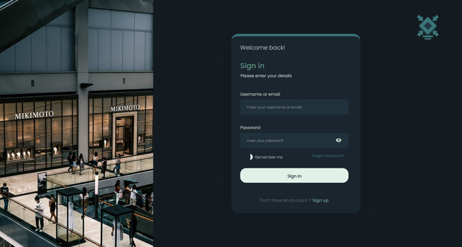
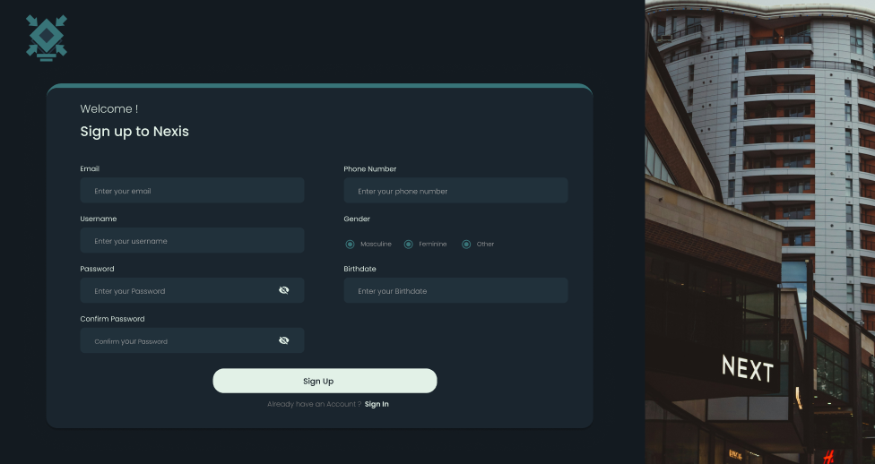
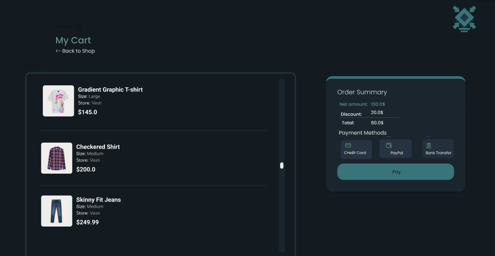

# Informe del Desarrollo de Nexis

    

## Introduccion
La presente aplicación está diseñada para facilitar las operaciones de compra y venta de productos en un centro comercial, junto a la gestion de las tiendas de este. Su objetivo principal es permitir que propietarios de locales puedan administrar sus negocios a través de una plataforma tecnológica moderna y eficiente. La aplicación sigue un esquema no-monolitico, con el backend separado del frontend.

## Tecnologías Utilizadas y Propósito
### Backend - Rust:

Se eligió **Rust** debido a su alto desempeño y seguridad en la gestión de memoria. Este lenguaje permite construir un backend robusto y eficiente, ideal para manejar grandes volúmenes de datos y operaciones simultáneas. Para garantizar la comunicación segura, se implementó **HTTPS** utilizando **rustls**, una librería moderna y segura para la gestión de conexiones **TLS**. Además, se aprovechó la asincronía mediante el uso de **Tokio**, un runtime de alta performance que permite manejar múltiples tareas concurrentes de manera eficiente.

El framework de backend elegido fue **Actix-web**, conocido por su velocidad y compatibilidad con Tokio, lo que asegura una arquitectura ágil y confiable. Asimismo, se implementó autenticación basada en **PASETOs** (Platform-Agnostic Security Tokens), una alternativa moderna y segura a los JWTs, que garantiza la integridad y confidencialidad de los tokens utilizados para la autenticación y autorización de usuarios.

### Frontend - Swagger:

Inicialmente, el desarrollo del frontend se planificó utilizando **Svelte**, **SvelteKit**, **TailwindCSS** y **Bootstrap** para ofrecer una experiencia de usuario moderna, escalable y responsiva. Sin embargo, debido a la complejidad en el tiempo de desarrollo, esta opción fue descartada. En su lugar, se optó por **Swagger Hub**, que facilita la documentación interactiva del API y asegura una integración clara y precisa entre el backend y los consumidores de la API. Esta decisión permitió simplificar el desarrollo y priorizar las funcionalidades clave.

Previo a decidir utilizar Swagger Hub, se realizaron varios diseños del frontend en **Figma**, algunos de los cuales se muestran a continuacion:

    <i>Pantalla de Sign-in</i>

 

    <i>Pantalla de Sign-up</i>

 

    <i>Pantalla de carrito de compras del cliente</i>

### Bases de Datos:
* **MongoDB Atlas**: Utilizado como el data lakehouse para almacenar grandes volúmenes de datos sin estructura fija como el inventario de las tiendas.

* **PostgreSQL**: Actúa como el data warehouse, optimizado para realizar consultas rápidas y análisis de datos estructurados como estadisticas de ventas y usuarios actuales.

* **Redis**: Implementado para gestionar sesiones de usuario y mejorar el rendimiento de la aplicación mediante el almacenamiento en caché de datos frecuentes.

## Modelos de datos
* [Lakehouse - MongoDB](./db-model/mongodb/)
* [Warehouse - PostgreSQL](./db-model/postgresql/)

## Documentacion de la API
La documentación de la API describe detalladamente los endpoints disponibles en el sistema, sus propósitos, los métodos HTTP utilizados, los roles necesarios para acceder a ellos y los formatos de las solicitudes y respuestas esperadas. Cada endpoint se presenta de manera clara y estructurada, proporcionando información como:

* **URL**: La ruta específica para acceder al recurso.
Method: El método HTTP asociado, como POST, GET, PUT, o DELETE.
* **Description**: Un resumen del objetivo del endpoint.
* **Role**: Los permisos o roles requeridos para acceder al recurso.
* **Request body**: El formato y ejemplo del cuerpo de la solicitud, cuando es necesario enviar datos.
* **Response**: Los posibles códigos de estado HTTP devueltos y su significado, indicando el éxito o errores que puedan surgir.

Para acceder a la documentacion de la API, haga click [aquí](./app/backend/nexis-rs/README.md).

## Contribuciones de los desarrolladores
* **Javier Pérez** (Project Manager): Gestión del proyecto, diseño de la arquitectura de la aplicación, desarrollo del backend, diseño de las páginas en Figma, creación de mock data y modelado de las bases de datos.
* **David Esber** (Database Engineer): Modelado de las bases de datos y montado de las mismas.
* **Rebecca Bracho** (Programmer): Diseño de las páginas en Figma e implementación del frontend en Swagger Hub.
* **Geanfranco Piccioni** (Programmer): (presunta) creación de un script para la carga de datos en el warehouse.